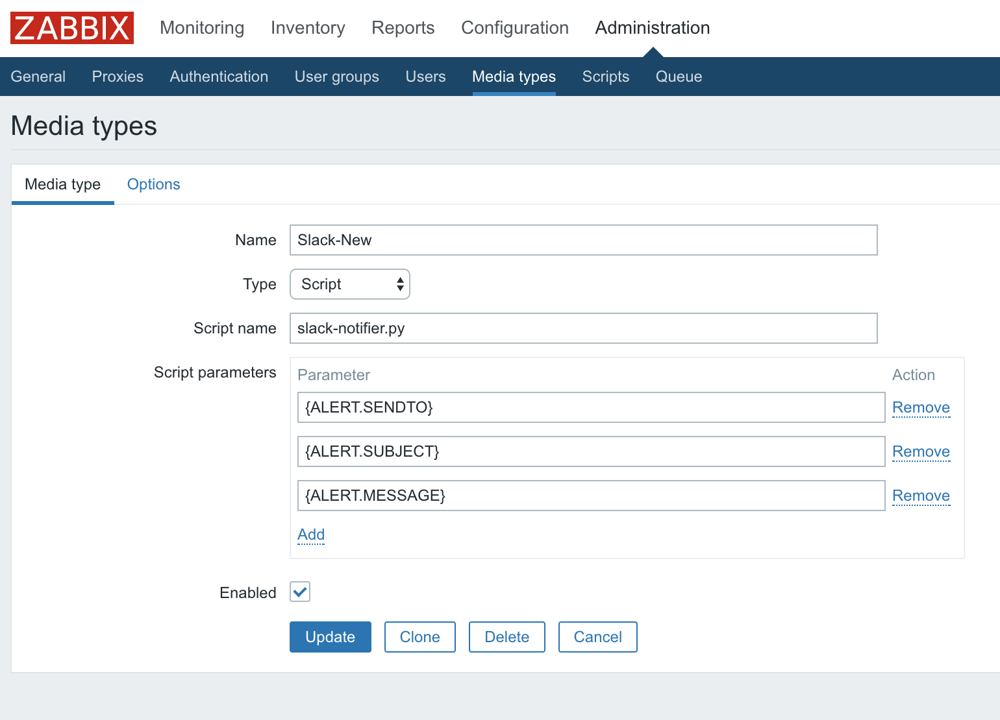
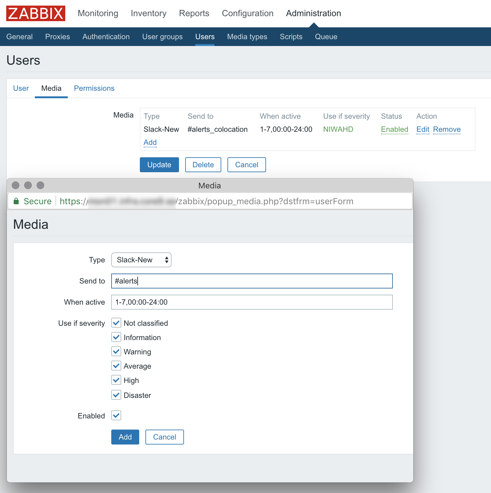
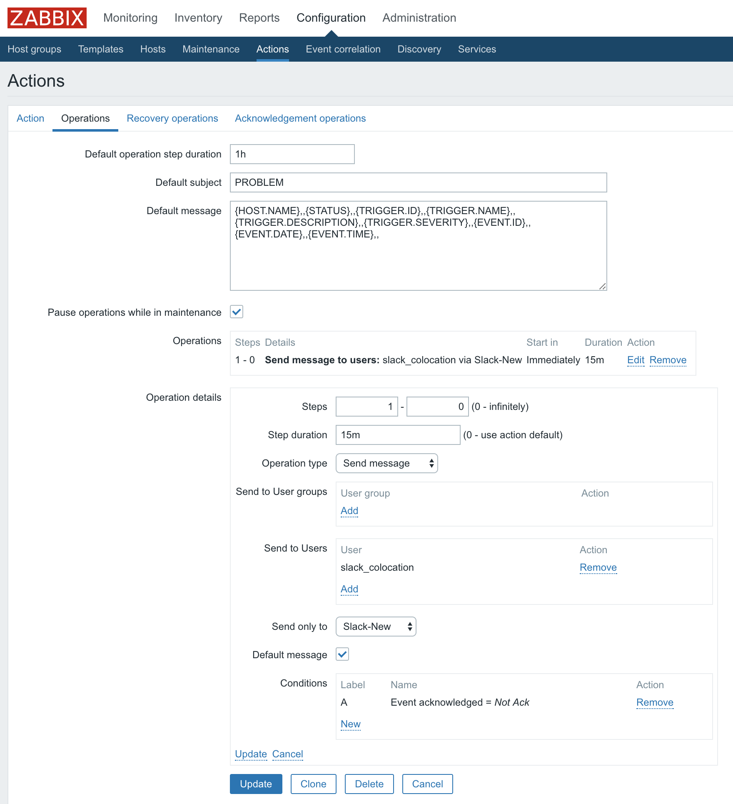
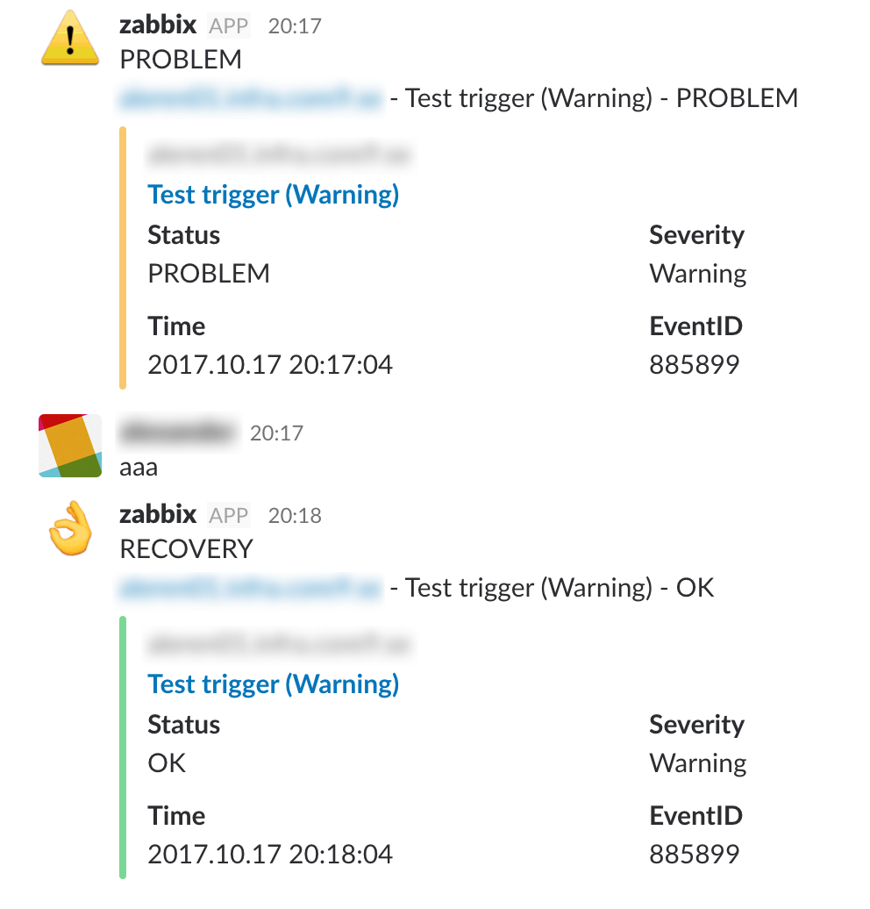

# Zabbix Slack Notifier

Simple python script to send notifications to Slack using `attachments: []` so that they look pretty in the chat.

Only tested in Zabbix 3.4 on Ubuntu 14.04 and 16.04

## Setup
Put your Slack webhook and url to your Zabbix install in the top of the python script. Lines 9 and 10. You can change the username the messages will seem to come from here too.

Place the script in the custom alert scripts location. It's defined by the `AlertScriptsPath=` setting in your __zabbix_server.conf__ file.

Make it executable with `chmod +x`.

Create a media type in Zabbix that uses the python script and the following three parameters:

* `{ALERT.SENDTO}`
* `{ALERT.SUBJECT}`
* `{ALERT.MESSAGE}`

Add this media to a zabbix user, set the channel you want the messages sent to and at which times and severities.

Create an action that uses exactly the following as operation and recovery operation default messages.

Operation

`{HOST.NAME},,{STATUS},,{TRIGGER.ID},,{TRIGGER.NAME},,{TRIGGER.DESCRIPTION},,{TRIGGER.SEVERITY},,{EVENT.ID},,{EVENT.DATE},,{EVENT.TIME},,`

Recovery operation

`{HOST.NAME},,{STATUS},,{TRIGGER.ID},,{TRIGGER.NAME},,{TRIGGER.DESCRIPTION},,{TRIGGER.SEVERITY},,{EVENT.ID},,{EVENT.RECOVERY.DATE},,{EVENT.RECOVERY.TIME},,`

Set the operations to send to your user from earlier also. You can set the repeat interval and conditions as well. In this example messages will be sent every 15 minutes until the trigger has been acknowledged.

And finally... Wait for the alerts to start coming it. The emoji and colour of the attachment depends on which severity the trigger has or if it's a recovery-event.

Slack won't show emoji on repeated messages from the same user unless enough time has passed so don't worry if some emoji seem to be missing.

Clicking on the name of the trigger will take you to the event in the Zabbix web UI. This is why it's defined up top along with the webhook.

